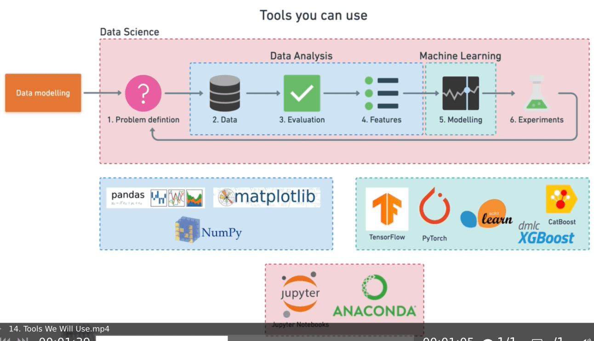

# <p style="text-align: center;">zerotomastery-complete-machine-learning-and-data-science</p>

# Table of Contents

- [zerotomastery-complete-machine-learning-and-data-science](#zerotomastery-complete-machine-learning-and-data-science)
- [Table of Contents](#table-of-contents)
- [Course Outline](#course-outline)
- [What Is Machine Learning](#what-is-machine-learning)
- [How Did We Get Here](#how-did-we-get-here)
- [Types of Machine Learning](#types-of-machine-learning)
- [Machine Learning and Data Science Framework](#machine-learning-and-data-science-framework)
- [6 Steps Machine Learning Framework](#6-steps-machine-learning-framework)
  - [Problem definition — What business problem are we trying to solve? How can it be phrased as a machine learning problem?](#problem-definitionwhat-business-problem-are-we-trying-to-solve-how-can-it-be-phrased-as-a-machine-learning-problem)
  - [Data — If machine learning is getting insights out of data, what data we have? How does it match the problem definition? Is our data structured or unstructured? Static or streaming?](#dataif-machine-learning-is-getting-insights-out-of-data-what-data-we-have-how-does-it-match-the-problem-definition-is-our-data-structured-or-unstructured-static-or-streaming)
  - [Evaluation — What defines success? Is a 95% accurate machine learning model good enough?](#evaluationwhat-defines-success-is-a-95-accurate-machine-learning-model-good-enough)
  - [Features — What parts of our data are we going to use for our model? How can what we already know influence this?](#featureswhat-parts-of-our-data-are-we-going-to-use-for-our-model-how-can-what-we-already-know-influence-this)
  - [Modelling — Which model should you choose? How can you improve it? How do you compare it with other models?](#modellingwhich-model-should-you-choose-how-can-you-improve-it-how-do-you-compare-it-with-other-models)
  - [Experimentation — What else could we try? Does our deployed model do as we expected? How do the other steps change based on what we’ve found?](#experimentationwhat-else-could-we-try-does-our-deployed-model-do-as-we-expected-how-do-the-other-steps-change-based-on-what-weve-found)
- [Types of Machine Learning Problems](#types-of-machine-learning-problems)
- [Types of Data](#types-of-data)
- [Types of Evaluation](#types-of-evaluation)
- [Features In Data](#features-in-data)
- [Modelling - Splitting Data](#modelling---splitting-data)
- [Modelling - Picking the Model](#modelling---picking-the-model)
- [Modelling - Tuning](#modelling---tuning)
- [Modelling - Comparison](#modelling---comparison)
- [Experimentation](#experimentation)
- [Tools](#tools)
- [Pandas Introduction](#pandas-introduction)
- [Series, Data Frames and CSVs](#series-data-frames-and-csvs)
- [Describing Data with Pandas](#describing-data-with-pandas)
- [Selecting and Viewing Data with Pandas](#selecting-and-viewing-data-with-pandas)
- [Manipulating Data with Pandas](#manipulating-data-with-pandas)
    - [Key Functionalities of Pandas:](#key-functionalities-of-pandas)
      - [1. **Data Structures:**](#1-data-structures)
      - [2. **Reading and Writing Data:**](#2-reading-and-writing-data)
      - [3. **Selecting and Filtering Data:**](#3-selecting-and-filtering-data)
      - [4. **Handling Missing Data:**](#4-handling-missing-data)
      - [5. **Grouping and Aggregating Data:**](#5-grouping-and-aggregating-data)
      - [6. **Merging and Concatenating DataFrames:**](#6-merging-and-concatenating-dataframes)
      - [7. **Time Series Analysis:**](#7-time-series-analysis)
    - [Practical Tips for Effective Data Manipulation:](#practical-tips-for-effective-data-manipulation)
      - [1. **Avoiding Chain Indexing:**](#1-avoiding-chain-indexing)
      - [2. **Utilizing Vectorized Operations:**](#2-utilizing-vectorized-operations)
      - [3. **Applying Functions:**](#3-applying-functions)
      - [4. **Avoiding Iteration When Possible:**](#4-avoiding-iteration-when-possible)
      - [5. **Understanding Copy and View:**](#5-understanding-copy-and-view)
      - [6. **Exploring Pandas Documentation:**](#6-exploring-pandas-documentation)
  - [String, number manipulation in details](#string-number-manipulation-in-details)
    - [1. **Creating Arrays from Lists:**](#1-creating-arrays-from-lists)
    - [2. **Using NumPy Functions:**](#2-using-numpy-functions)
    - [3. **Creating Arrays with a Range:**](#3-creating-arrays-with-a-range)
    - [4. **Creating Arrays with Linear Spacing:**](#4-creating-arrays-with-linear-spacing)
    - [5. **Creating Identity Matrix:**](#5-creating-identity-matrix)
    - [6. **Random Number Arrays:**](#6-random-number-arrays)
    - [7. **Reshaping Arrays:**](#7-reshaping-arrays)
    - [8. **Combining Arrays:**](#8-combining-arrays)
    - [9. **Using Meshgrid:**](#9-using-meshgrid)
    - [10. **Using `fromfunction`:**](#10-using-fromfunction)
    - [Practical Tips:](#practical-tips)
  - [fillna techniques](#fillna-techniques)
    - [1. **Basic Techniques:**](#1-basic-techniques)
      - [**a. Fill with a Constant Value:**](#a-fill-with-a-constant-value)
      - [**b. Forward Fill (ffill) and Backward Fill (bfill):**](#b-forward-fill-ffill-and-backward-fill-bfill)
    - [2. **Advanced Techniques:**](#2-advanced-techniques)
      - [**a. Interpolation:**](#a-interpolation)
      - [**b. Mean, Median, or Mode Imputation:**](#b-mean-median-or-mode-imputation)
      - [**c. Fill with Custom Function:**](#c-fill-with-custom-function)
    - [3. **Handling Missing Values in Different Data Types:**](#3-handling-missing-values-in-different-data-types)
      - [**a. Numerical Data:**](#a-numerical-data)
      - [**b. Categorical Data:**](#b-categorical-data)
      - [**c. Time-Series Data:**](#c-time-series-data)
    - [4. **Handling Missing Values in Large Datasets:**](#4-handling-missing-values-in-large-datasets)
      - [**a. Memory-Efficient Techniques:**](#a-memory-efficient-techniques)
      - [**b. Drop Missing Values:**](#b-drop-missing-values)
      - [**c. Sampling for Imputation:**](#c-sampling-for-imputation)
    - [Best Practices and Tips:](#best-practices-and-tips)
  - [dropna](#dropna)
    - [1. **Basic Techniques:**](#1-basic-techniques-1)
      - [**a. Dropping Rows with Missing Values:**](#a-dropping-rows-with-missing-values)
      - [**b. Dropping Columns with Missing Values:**](#b-dropping-columns-with-missing-values)
    - [2. **Advanced Techniques:**](#2-advanced-techniques-1)
      - [**a. Threshold for Non-Missing Values:**](#a-threshold-for-non-missing-values)
      - [**b. Drop Based on Subset of Columns:**](#b-drop-based-on-subset-of-columns)
      - [**c. Handling Missing Values in Specific Columns:**](#c-handling-missing-values-in-specific-columns)
    - [3. **Best Practices and Tips:**](#3-best-practices-and-tips)
      - [**a. Consideration of Data Impact:**](#a-consideration-of-data-impact)
      - [**b. Balance Between Imputation and Dropping:**](#b-balance-between-imputation-and-dropping)
      - [**c. Use of `inplace` Parameter:**](#c-use-of-inplace-parameter)
      - [**d. Customized Thresholds:**](#d-customized-thresholds)
      - [**e. Chain Dropna with Other Operations:**](#e-chain-dropna-with-other-operations)
    - [4. **Considerations for Efficient Data Cleaning:**](#4-considerations-for-efficient-data-cleaning)
      - [**a. Memory Efficiency:**](#a-memory-efficiency)
      - [**b. Handling Missing Values in Large Datasets:**](#b-handling-missing-values-in-large-datasets)
      - [**c. Logically Order Cleaning Steps:**](#c-logically-order-cleaning-steps)
      - [**d. Visualize Missing Data:**](#d-visualize-missing-data)
  - [New columns from Series | python list | single value](#new-columns-from-series--python-list--single-value)
    - [1. **Using a Series:**](#1-using-a-series)
      - [**a. Creating a DataFrame:**](#a-creating-a-dataframe)
      - [**b. Creating a Series:**](#b-creating-a-series)
      - [**c. Adding the Series as a New Column:**](#c-adding-the-series-as-a-new-column)
    - [2. **Using a Python List:**](#2-using-a-python-list)
      - [**a. Creating a DataFrame:**](#a-creating-a-dataframe-1)
      - [**b. Creating a Python List:**](#b-creating-a-python-list)
      - [**c. Adding the List as a New Column:**](#c-adding-the-list-as-a-new-column)
    - [3. **Using a Single Value:**](#3-using-a-single-value)
      - [**a. Creating a DataFrame:**](#a-creating-a-dataframe-2)
      - [**b. Using a Single Value:**](#b-using-a-single-value)
      - [**c. Adding the Single Value as a New Column:**](#c-adding-the-single-value-as-a-new-column)
    - [**Potential Challenges and Considerations:**](#potential-challenges-and-considerations)
  - [drop axis](#drop-axis)
    - [1. **Basics of Dropping Axes:**](#1-basics-of-dropping-axes)
      - [**a. Dropping Rows (axis=0):**](#a-dropping-rows-axis0)
      - [**b. Dropping Columns (axis=1):**](#b-dropping-columns-axis1)
    - [2. **Dropping Based on Conditions:**](#2-dropping-based-on-conditions)
      - [**a. Dropping Rows Based on a Condition:**](#a-dropping-rows-based-on-a-condition)
      - [**b. Dropping Columns Based on a Condition:**](#b-dropping-columns-based-on-a-condition)
    - [3. **Handling Missing Values:**](#3-handling-missing-values)
      - [**a. Dropping Rows with Missing Values:**](#a-dropping-rows-with-missing-values-1)
      - [**b. Dropping Columns with Missing Values:**](#b-dropping-columns-with-missing-values-1)
    - [4. **Handling Duplicates:**](#4-handling-duplicates)
      - [**a. Dropping Duplicate Rows:**](#a-dropping-duplicate-rows)
      - [**b. Dropping Duplicate Columns:**](#b-dropping-duplicate-columns)
    - [5. **Advanced Techniques and Best Practices:**](#5-advanced-techniques-and-best-practices)
      - [**a. Dropping Rows with Null Values in Specific Columns:**](#a-dropping-rows-with-null-values-in-specific-columns)
      - [**b. Avoiding Chain Indexing:**](#b-avoiding-chain-indexing)
      - [**c. In-Place Dropping:**](#c-in-place-dropping)
      - [**d. Drop Based on Index:**](#d-drop-based-on-index)
  - [pandas sample function,  shuffle data](#pandas-sample-function--shuffle-data)
    - [**Syntax:**](#syntax)
    - [**Parameters:**](#parameters)
    - [**Examples:**](#examples)
      - [**1. Simple Random Sample:**](#1-simple-random-sample)
      - [**2. Shuffling Data:**](#2-shuffling-data)
      - [**3. Weighted Sampling:**](#3-weighted-sampling)
    - [**When to Use `sample`:**](#when-to-use-sample)
    - [**Considerations:**](#considerations)
    - [**Example Use Case: Shuffling Data for Train-Test Split:**](#example-use-case-shuffling-data-for-train-test-split)
  - [apply lambda function technique](#apply-lambda-function-technique)
    - [**Basics of Applying `lambda` in Pandas:**](#basics-of-applying-lambda-in-pandas)
      - [**1. Defining a Simple Lambda Function:**](#1-defining-a-simple-lambda-function)
      - [**2. Applying Lambda to Multiple Columns:**](#2-applying-lambda-to-multiple-columns)
    - [**Advanced Concepts:**](#advanced-concepts)
      - [**1. Conditional Operations with `lambda`:**](#1-conditional-operations-with-lambda)
      - [**2. Using `map` with `lambda`:**](#2-using-map-with-lambda)
      - [**3. `apply` with Multiple Arguments:**](#3-apply-with-multiple-arguments)
    - [**Benefits and Use Cases:**](#benefits-and-use-cases)
      - [**1. Conciseness and Readability:**](#1-conciseness-and-readability)
      - [**2. Element-Wise Transformations:**](#2-element-wise-transformations)
      - [**3. Conditional Transformations:**](#3-conditional-transformations)
      - [**4. Quick Data Exploration:**](#4-quick-data-exploration)
    - [**Practical Example: Normalizing Columns with `lambda`:**](#practical-example-normalizing-columns-with-lambda)
- [NumPy Introduction](#numpy-introduction)
  - [What is NumPy and Why NumPy?](#what-is-numpy-and-why-numpy)
    - [**Basics of NumPy:**](#basics-of-numpy)
      - [\*\*1. **Installation:**](#1-installation)
      - [**2. Importing NumPy:**](#2-importing-numpy)
      - [**3. Creating NumPy Arrays:**](#3-creating-numpy-arrays)
      - [**4. NumPy Array Attributes:**](#4-numpy-array-attributes)
    - [**Significance of NumPy:**](#significance-of-numpy)
      - [\*\*1. **Efficient Operations:**](#1-efficient-operations)
      - [**2. Broadcasting:**](#2-broadcasting)
      - [**3. Universal Functions (ufuncs):**](#3-universal-functions-ufuncs)
      - [**4. Memory Efficiency:**](#4-memory-efficiency)
      - [**5. Multidimensional Operations:**](#5-multidimensional-operations)
    - [**Comparison with Python Lists:**](#comparison-with-python-lists)
      - [**1. Performance:**](#1-performance)
      - [**2. Syntax and Ease of Use:**](#2-syntax-and-ease-of-use)
      - [**3. Mathematical Operations:**](#3-mathematical-operations)
      - [**4. Homogeneity:**](#4-homogeneity)
      - [**5. Broadcasting:**](#5-broadcasting)
    - [**Practical Example: Dot Product Calculation:**](#practical-example-dot-product-calculation)
- [NumPy DataTypes and Attributes](#numpy-datatypes-and-attributes)
  - [ndarray in depth (shape, ndim, dtypes, size, type)](#ndarray-in-depth-shape-ndim-dtypes-size-type)
    - [**Basics of NumPy ndarray:**](#basics-of-numpy-ndarray)
      - [\*\*1. **Creating ndarray:**](#1-creating-ndarray)
      - [**2. Attributes of ndarray:**](#2-attributes-of-ndarray)
    - [**Advanced Concepts:**](#advanced-concepts-1)
      - [**1. Reshaping Arrays:**](#1-reshaping-arrays)
      - [**2. Slicing and Indexing:**](#2-slicing-and-indexing)
      - [**3. Element-Wise Operations:**](#3-element-wise-operations)
      - [**4. Broadcasting:**](#4-broadcasting)
      - [**5. Universal Functions (ufuncs):**](#5-universal-functions-ufuncs)
      - [**6. Aggregation Functions:**](#6-aggregation-functions)
    - [**Attributes Contribution to Functionality and Versatility:**](#attributes-contribution-to-functionality-and-versatility)
      - [**1. Shape and ndim:**](#1-shape-and-ndim)
      - [**2. dtypes:**](#2-dtypes)
      - [**3. Size:**](#3-size)
      - [**4. Type:**](#4-type)
  - [create dataframes from numpy arrays](#create-dataframes-from-numpy-arrays)
- [Creating NumPy Arrays](#creating-numpy-arrays)
  - [All ways to create numpy arrays](#all-ways-to-create-numpy-arrays)
    - [**Example 1: Creating DataFrame from 1D NumPy Array:**](#example-1-creating-dataframe-from-1d-numpy-array)
    - [**Example 2: Creating DataFrame from 2D NumPy Array:**](#example-2-creating-dataframe-from-2d-numpy-array)
    - [**Example 3: Creating DataFrame with Index:**](#example-3-creating-dataframe-with-index)
    - [**Example 4: Creating DataFrame with Mixed Data Types:**](#example-4-creating-dataframe-with-mixed-data-types)
  - [random seed in depth](#random-seed-in-depth)
    - [**What is a Random Seed?**](#what-is-a-random-seed)
    - [**Importance of Setting a Random Seed:**](#importance-of-setting-a-random-seed)
    - [**How to Set a Random Seed:**](#how-to-set-a-random-seed)
    - [**Practical Use Cases:**](#practical-use-cases)
      - [**1. Machine Learning:**](#1-machine-learning)
      - [**2. Simulations:**](#2-simulations)
      - [**3. Data Analysis:**](#3-data-analysis)
      - [**4. Teaching and Documentation:**](#4-teaching-and-documentation)
    - [**Caution:**](#caution)
  - [Viewing Arrays and Matrices](#viewing-arrays-and-matrices)
    - [\*\*1. **Printing Arrays:**](#1-printing-arrays)
    - [**2. Displaying Shape and Dimensions:**](#2-displaying-shape-and-dimensions)
    - [**3. Viewing Specific Elements:**](#3-viewing-specific-elements)
    - [**4. NumPy Functions for Exploration:**](#4-numpy-functions-for-exploration)
    - [**5. Using `numpy.info()`:**](#5-using-numpyinfo)
    - [**6. Visualizing with Matplotlib:**](#6-visualizing-with-matplotlib)
    - [**7. Printing with Precision:**](#7-printing-with-precision)
  - [Manipulating and comparing Arrays](#manipulating-and-comparing-arrays)
    - [**Array Manipulation:**](#array-manipulation)
      - [**1. Reshaping Arrays:**](#1-reshaping-arrays-1)
      - [**2. Concatenating Arrays:**](#2-concatenating-arrays)
    - [**Array Comparison:**](#array-comparison)
      - [**1. Element-wise Comparison:**](#1-element-wise-comparison)
      - [**2. Array-wise Comparison:**](#2-array-wise-comparison)
      - [**3. Logical Operations:**](#3-logical-operations)
    - [**Array Sorting:**](#array-sorting)
      - [**1. Sorting along an Axis:**](#1-sorting-along-an-axis)
      - [**2. Finding Indices of Sorted Elements:**](#2-finding-indices-of-sorted-elements)
  - [Arithmetic and Aggregation](#arithmetic-and-aggregation)
    - [**Arithmetic Operations:**](#arithmetic-operations)
      - [**1. Element-wise Operations:**](#1-element-wise-operations)
      - [**2. Broadcasting:**](#2-broadcasting-1)
    - [**Aggregation Operations:**](#aggregation-operations)
      - [**1. Sum, Mean, Min, and Max:**](#1-sum-mean-min-and-max)
      - [**2. Aggregation along Axes:**](#2-aggregation-along-axes)
      - [**3. Cumulative Sum:**](#3-cumulative-sum)
    - [**Universal Functions (ufuncs):**](#universal-functions-ufuncs)
- [Reshaping and transposing arrays using numpy](#reshaping-and-transposing-arrays-using-numpy)
    - [Reshaping Arrays:](#reshaping-arrays)
    - [Transposing Arrays:](#transposing-arrays)
    - [Best Practices:](#best-practices)
    - [How to run an .ipynb Jupyter Notebook from terminal?](#how-to-run-an-ipynb-jupyter-notebook-from-terminal)
  - [Dot Product vs Element Wise](#dot-product-vs-element-wise)
    - [**Dot Product:**](#dot-product)
      - [**Definition:**](#definition)
      - [**Use Cases:**](#use-cases)
      - [**Advantages:**](#advantages)
      - [**Example:**](#example)
    - [**Element-wise Operations:**](#element-wise-operations)
      - [**Definition:**](#definition-1)
      - [**Use Cases:**](#use-cases-1)
      - [**Advantages:**](#advantages-1)
      - [**Example:**](#example-1)
  - [Comparison Operators](#comparison-operators)
    - [**Common Comparison Operators:**](#common-comparison-operators)
      - [**1. Element-wise Comparisons:**](#1-element-wise-comparisons)
      - [**2. Array-wise Comparisons:**](#2-array-wise-comparisons)
    - [**Practical Examples:**](#practical-examples)
      - [**Element-wise Comparisons:**](#element-wise-comparisons)
      - [**Array-wise Comparison:**](#array-wise-comparison)
    - [**Importance in Data Analysis and Scientific Computations:**](#importance-in-data-analysis-and-scientific-computations)
  - [Sorting Arrays](#sorting-arrays)
    - [**1. Sorting 1D Arrays:**](#1-sorting-1d-arrays)
      - [**Ascending Order:**](#ascending-order)
      - [**Descending Order:**](#descending-order)
    - [**2. Sorting Multidimensional Arrays:**](#2-sorting-multidimensional-arrays)
      - [**Sorting Along a Specific Axis:**](#sorting-along-a-specific-axis)
      - [**Sorting with argsort:**](#sorting-with-argsort)
    - [**Considerations for Large Arrays:**](#considerations-for-large-arrays)
  - [Turn images into numpy arrays](#turn-images-into-numpy-arrays)
- [Anatomy Of A Matplotlib Figure](#anatomy-of-a-matplotlib-figure)
    - [**Key Components of a Matplotlib Figure:**](#key-components-of-a-matplotlib-figure)
      - [\*\*1. **Figure:**](#1-figure)
      - [\*\*2. **Axes:**](#2-axes)
      - [\*\*3. **Axis:**](#3-axis)
      - [\*\*4. **Plot:**](#4-plot)
      - [\*\*5. **Legend:**](#5-legend)
      - [\*\*6. **Title:**](#6-title)
    - [**Interactions between Components:**](#interactions-between-components)
    - [**Example:**](#example-2)
  - [\_\_\_\_\_\_\_\_\_\_\_\_\_\_](#______________)
  - [\_\_\_\_\_\_\_\_\_\_\_\_\_\_](#______________-1)

--------------
# <p style="text-align: center;">Course Outline</p>

<p align="center">
  
</p>

<p align="center">
  
  
  
</p>

--------------
# <p style="text-align: center;">What Is Machine Learning</p>

<p align="center">
  
  
  
</p>

<p align="center">
  
  
  
</p>

<p align="center">
  
  
</p>

--------------
# <p style="text-align: center;">How Did We Get Here</p>

<p align="center">
  
</p>

--------------
# <p style="text-align: center;">Types of Machine Learning</p>

<p align="center">
  
</p>

--------------
# <p style="text-align: center;">Machine Learning and Data Science Framework</p>

<p align="center">
  
  
</p>

--------------
# <p style="text-align: center;">[6 Steps](https://www.mrdbourke.com/a-6-step-field-guide-for-building-machine-learning-projects/) Machine Learning Framework</p>

<p align="center">
  
  
</p>

<p align="center">
  
  
</p>

<p align="center">
  
  
</p>

## Problem definition — What business problem are we trying to solve? How can it be phrased as a machine learning problem?

- To help decide **whether or not** your business could use machine learning, the first step is to **match the** business **problem** you’re trying **to** solve **a machine learning problem**.
- The three most used in business applications are 
  - **supervised learning**
    - because you have data and labels
    - algorithm tries to learn what patterns in the data lead to the labels.
    - The supervised part happens during training. If the algorithm guesses a wrong label, it tries to correct itself.
  - **unsupervised learning**
    - have data but no labels
    - may want to group similar data together, After inspecting the groups, you provide the labels
    - algorithm did not provide these labels, It found the patterns between similar data and using your domain knowledge, you provided the labels
  - **transfer learning**
    - when you take the information an existing machine learning model has learned and adjust it to your own problem
    - Training a ML model from scratch can be expensive and time-consuming
    - When ML algorithms find patterns in one kind of data, these patterns can be used in another type of data

## Data — If machine learning is getting insights out of data, what data we have? How does it match the problem definition? Is our data structured or unstructured? Static or streaming?

## Evaluation — What defines success? Is a 95% accurate machine learning model good enough?

## Features — What parts of our data are we going to use for our model? How can what we already know influence this?

## Modelling — Which model should you choose? How can you improve it? How do you compare it with other models?

## Experimentation — What else could we try? Does our deployed model do as we expected? How do the other steps change based on what we’ve found?

--------------
# <p style="text-align: center;">Types of Machine Learning Problems</p>

<p align="center">
  
  
  
</p>

<p align="center">
  
  
  
</p>

<p align="center">
  
  
  
</p>

--------------
# <p style="text-align: center;">Types of Data</p>

<p align="center">
  
  
</p>

<p align="center">
  
  
</p>

--------------
# <p style="text-align: center;">Types of Evaluation</p>

<p align="center">
  
  
</p>

<p align="center">
  
  
</p>

--------------
# <p style="text-align: center;">Features In Data</p>

<p align="center">
  
  
</p>

<p align="center">
  
  
</p>

--------------
# <p style="text-align: center;">Modelling - Splitting Data</p>

<p align="center">
  
  
</p>

<p align="center">
  
  
</p>

--------------
# <p style="text-align: center;">Modelling - Picking the Model</p>

<p align="center">
  
  
</p>

<p align="center">
  
  
  
</p>

--------------
# <p style="text-align: center;">Modelling - Tuning</p>

<p align="center">
  
  
</p>

<p align="center">
  
  
</p>

--------------
# <p style="text-align: center;">Modelling - Comparison</p>

<p align="center">
  
  
</p>

<p align="center">
  
  
</p>

<p align="center">
  
  
</p>

<p align="center">
  
  
</p>

--------------
# <p style="text-align: center;">Experimentation</p>

<p align="center">
  
</p>

--------------
# <p style="text-align: center;">Tools</p>

<p align="center">
  
  
</p>

<p align="center">
  
  
</p>

<p align="center">
  
  
</p>

<p align="center">
  
  
</p>

<p align="center">
  
  
</p>

--------------
# <p style="text-align: center;">[Pandas Introduction](https://github.com/mrdbourke/zero-to-mastery-ml/blob/master/section-2-data-science-and-ml-tools/introduction-to-pandas-video.ipynb)</p>

<p align="center">
  
  
</p>

<p align="center">
  
  
</p>

--------------
# <p style="text-align: center;">Series, Data Frames and CSVs</p>

<p align="center">
  
  
</p>

<p align="center">
  
  
</p>

--------------
# <p style="text-align: center;">Describing Data with [Pandas](https://pandas.pydata.org/docs/user_guide/10min.html)</p>

<p align="center">
  
  
</p>

<p align="center">
  
  
</p>

--------------
# <p style="text-align: center;">Selecting and Viewing Data with [Pandas](https://pandas.pydata.org/pandas-docs/stable/)</p>

<p align="center">
  
  
</p>

<p align="center">
  
  
</p>

<p align="center">
  
  
</p>

<p align="center">
  
  
</p>

--------------
# <p style="text-align: center;">[Manipulating Data with Pandas](https://jakevdp.github.io/PythonDataScienceHandbook/03.00-introduction-to-pandas.html)</p>

### Key Functionalities of Pandas:

#### 1. **Data Structures:**
   - **Series:** A one-dimensional labeled array, similar to a column in a spreadsheet.
   - **DataFrame:** A two-dimensional table with labeled axes (rows and columns), similar to a spreadsheet or SQL table.

#### 2. **Reading and Writing Data:**
   - Pandas supports reading and writing data in various formats, including CSV, Excel, SQL, and more.

   ```python
   import pandas as pd

   # Reading a CSV file
   df = pd.read_csv('data.csv')

   # Writing to an Excel file
   df.to_excel('output.xlsx', index=False)
   ```

#### 3. **Selecting and Filtering Data:**
   - Pandas allows you to select specific columns, filter rows based on conditions, and perform various data slicing operations.

   ```python
   # Selecting specific columns
   selected_columns = df[['Column1', 'Column2']]

   # Filtering rows based on a condition
   filtered_data = df[df['Column3'] > 50]
   ```

#### 4. **Handling Missing Data:**
   - Pandas provides methods to handle missing or NaN values, including dropping or filling them.

   ```python
   # Drop rows with missing values
   df_cleaned = df.dropna()

   # Fill missing values with a specific value
   df_filled = df.fillna(0)
   ```

#### 5. **Grouping and Aggregating Data:**
   - You can group data based on certain criteria and perform aggregate functions on the groups.

   ```python
   # Group by a column and calculate the mean
   grouped_data = df.groupby('Category')['Value'].mean()
   ```

#### 6. **Merging and Concatenating DataFrames:**
   - Pandas facilitates combining data from different sources through merging and concatenation.

   ```python
   # Merge two DataFrames based on a common column
   merged_df = pd.merge(df1, df2, on='CommonColumn')

   # Concatenate DataFrames vertically
   concatenated_df = pd.concat([df1, df2], axis=0)
   ```

#### 7. **Time Series Analysis:**
   - Pandas has robust support for time series data, including date/time indexing and various time-related functions.

   ```python
   # Convert a column to datetime format
   df['Date'] = pd.to_datetime(df['Date'])

   # Set the datetime column as the index
   df.set_index('Date', inplace=True)
   ```

### Practical Tips for Effective Data Manipulation:

#### 1. **Avoiding Chain Indexing:**
   - Instead of using multiple chained operations, use `.loc` or `.iloc` for explicit indexing. This avoids potential pitfalls with view versus copy behavior.

   ```python
   # Avoid chain indexing
   df['Column1'][df['Column2'] > 50] = 0

   # Use .loc for explicit indexing
   df.loc[df['Column2'] > 50, 'Column1'] = 0
   ```

#### 2. **Utilizing Vectorized Operations:**
   - Pandas supports vectorized operations, which are more efficient than iterative operations.

   ```python
   # Inefficient iterative operation
   for index, row in df.iterrows():
       df.at[index, 'NewColumn'] = row['Column1'] + row['Column2']

   # Efficient vectorized operation
   df['NewColumn'] = df['Column1'] + df['Column2']
   ```

#### 3. **Applying Functions:**
   - Use the `apply` function to apply custom functions to columns or rows.

   ```python
   # Apply a function to a column
   df['NewColumn'] = df['ExistingColumn'].apply(lambda x: custom_function(x))
   ```

#### 4. **Avoiding Iteration When Possible:**
   - Pandas is optimized for vectorized operations, and iterating over rows is usually slower. Look for ways to perform operations on entire columns.

   ```python
   # Iterating over rows (inefficient)
   for index, row in df.iterrows():
       df.at[index, 'NewColumn'] = custom_function(row['Column1'])

   # Vectorized operation (efficient)
   df['NewColumn'] = custom_function(df['Column1'])
   ```

#### 5. **Understanding Copy and View:**
   - Be aware of whether an operation returns a view or a copy of the data. Use explicit `copy` when needed to avoid unintended modifications.

   ```python
   # Creating a copy of the DataFrame
   df_copy = df.copy()

   # Modifying the copy without affecting the original
   df_copy['NewColumn'] = df_copy['ExistingColumn'] * 2
   ```

#### 6. **Exploring Pandas Documentation:**
   - The Pandas documentation is extensive and provides detailed explanations and examples for each function. Make it your go-to resource for understanding and using Pandas effectively.

   ```python
   # Access Pandas documentation
   pd.DataFrame.groupby?
   ```

## String, number manipulation in details

### 1. **Creating Arrays from Lists:**
   - The simplest way to create an array is from a Python list.

   ```python
   import numpy as np

   # 1D array from a list
   arr_1d = np.array([1, 2, 3])

   # 2D array from a list of lists
   arr_2d = np.array([[1, 2, 3], [4, 5, 6]])
   ```

### 2. **Using NumPy Functions:**
   - NumPy provides functions like `zeros`, `ones`, and `empty` to create arrays filled with zeros, ones, or uninitialized values.

   ```python
   # 1D array filled with zeros
   zeros_arr = np.zeros(3)

   # 2D array filled with ones
   ones_arr = np.ones((2, 3))

   # 3x3 uninitialized array (values are whatever is in the allocated memory)
   empty_arr = np.empty((3, 3))
   ```

### 3. **Creating Arrays with a Range:**
   - NumPy's `arange` function is useful for creating arrays with regularly spaced values.

   ```python
   # Array with values from 0 to 9
   range_arr = np.arange(10)

   # Array with values from 1 to 10 with step 2
   step_arr = np.arange(1, 11, 2)
   ```

### 4. **Creating Arrays with Linear Spacing:**
   - The `linspace` function creates arrays with a specified number of evenly spaced values between a start and end.

   ```python
   # Array with 5 evenly spaced values between 0 and 1
   linspace_arr = np.linspace(0, 1, 5)
   ```

### 5. **Creating Identity Matrix:**
   - The `eye` function creates a 2D identity matrix.

   ```python
   # 3x3 identity matrix
   identity_matrix = np.eye(3)
   ```

### 6. **Random Number Arrays:**
   - NumPy's `random` module provides functions for generating arrays with random values.

   ```python
   # 2x2 array of random values between 0 and 1
   random_arr = np.random.random((2, 2))

   # 2x2 array of random integers between 1 and 10
   random_int_arr = np.random.randint(1, 11, size=(2, 2))
   ```

### 7. **Reshaping Arrays:**
   - Use the `reshape` method to change the shape of an array.

   ```python
   # Reshape a 1D array to a 2D array
   arr = np.arange(6)
   reshaped_arr = arr.reshape(2, 3)
   ```

### 8. **Combining Arrays:**
   - Concatenate multiple arrays using functions like `concatenate` or `vstack` and `hstack`.

   ```python
   # Concatenate two 1D arrays
   arr1 = np.array([1, 2, 3])
   arr2 = np.array([4, 5, 6])
   concatenated_arr = np.concatenate((arr1, arr2))
   ```

### 9. **Using Meshgrid:**
   - The `meshgrid` function is useful for creating coordinate matrices for 2D plotting.

   ```python
   # Create coordinate matrices for 2D plotting
   x = np.linspace(0, 1, 3)
   y = np.linspace(0, 1, 2)
   X, Y = np.meshgrid(x, y)
   ```

### 10. **Using `fromfunction`:**
   - The `fromfunction` function creates an array by applying a function element-wise.

   ```python
   # Create an array using a function
   def my_function(i, j):
       return i + j

   func_arr = np.fromfunction(my_function, (3, 3))
   ```

### Practical Tips:

1. **Data Type Specification:**
   - Specify the `dtype` parameter when creating arrays to control the data type, which can improve memory efficiency.

   ```python
   # Create a float array
   float_arr = np.array([1, 2, 3], dtype=float)
   ```

2. **Array Copying:**
   - Be cautious with array copying. Changes to a copy may not affect the original array. Use `copy` explicitly when needed.

   ```python
   # Create a copy of the array
   arr_copy = arr.copy()
   ```

3. **Use Vectorized Operations:**
   - NumPy arrays support vectorized operations, making it more efficient than using loops.

   ```python
   # Vectorized operation
   result = arr1 + arr2
   ```

4. **Explore NumPy Documentation:**
   - The NumPy documentation is comprehensive. Explore it to discover more functions and understand their parameters.

   ```python
   # Access NumPy documentation
   np.info(np.arange)
   ```
## fillna techniques

### 1. **Basic Techniques:**

#### **a. Fill with a Constant Value:**
   - Fill missing values with a specific constant.

   ```python
   import pandas as pd
   import numpy as np

   # Create a DataFrame with missing values
   df = pd.DataFrame({'A': [1, 2, np.nan, 4]})

   # Fill missing values with a constant (e.g., 0)
   df_filled = df.fillna(0)
   ```

#### **b. Forward Fill (ffill) and Backward Fill (bfill):**
   - Propagate the last valid observation forward or use the next valid observation backward.

   ```python
   # Forward fill
   df_ffill = df.fillna(method='ffill')

   # Backward fill
   df_bfill = df.fillna(method='bfill')
   ```

### 2. **Advanced Techniques:**

#### **a. Interpolation:**
   - Use linear or polynomial interpolation to estimate missing values based on neighboring data points.

   ```python
   # Linear interpolation
   df_interpolated = df.interpolate()
   ```

#### **b. Mean, Median, or Mode Imputation:**
   - Fill missing values with the mean, median, or mode of the column.

   ```python
   # Mean imputation
   mean_value = df['A'].mean()
   df_mean_imputed = df.fillna(mean_value)
   ```

#### **c. Fill with Custom Function:**
   - Apply a custom function to fill missing values based on specific logic.

   ```python
   # Fill missing values based on a custom function
   def custom_fill(col):
       # Custom logic to fill missing values
       return col + 1

   df_custom_filled = df.apply(custom_fill)
   ```

### 3. **Handling Missing Values in Different Data Types:**

#### **a. Numerical Data:**
   - For numerical data, consider using statistical measures like mean, median, or interpolation.

   ```python
   # Fill missing values with the mean
   df_numeric = df.fillna(df.mean())
   ```

#### **b. Categorical Data:**
   - For categorical data, use the mode or a specific category for filling missing values.

   ```python
   # Fill missing values with the mode
   df_categorical = df.fillna(df.mode().iloc[0])
   ```

#### **c. Time-Series Data:**
   - For time-series data, utilize time-based methods such as forward fill or interpolation.

   ```python
   # Forward fill for time-series data
   df_time_series = df.fillna(method='ffill')
   ```

### 4. **Handling Missing Values in Large Datasets:**

#### **a. Memory-Efficient Techniques:**
   - Use memory-efficient data types (`float32` instead of `float64`) to reduce memory usage when working with large datasets.

   ```python
   # Convert to memory-efficient data types
   df['Column'] = df['Column'].astype('float32')
   ```

#### **b. Drop Missing Values:**
   - If missing values are a small percentage of the dataset, consider dropping rows or columns with missing values.

   ```python
   # Drop rows with any missing values
   df_cleaned = df.dropna()
   ```

#### **c. Sampling for Imputation:**
   - Instead of imputing missing values for the entire dataset, consider sampling a smaller subset for imputation to improve efficiency.

   ```python
   # Sample for imputation
   df_sampled = df.sample(frac=0.8)  # 80% of the data
   df_imputed = df_sampled.fillna(df_sampled.mean())
   ```

### Best Practices and Tips:

1. **Understand the Data:**
   - Investigate the reasons for missing data. Understanding the nature of missingness can guide the choice of imputation strategy.

2. **Evaluate Imputation Impact:**
   - Assess the impact of different imputation techniques on the overall analysis and model performance.

3. **Consider Domain Knowledge:**
   - Leverage domain knowledge to make informed decisions about imputation methods, especially for custom fill strategies.

4. **Handle Missing Data Early:**
   - Address missing data during the early stages of data preprocessing to avoid downstream issues.

5. **Use Multiple Imputation:**
   - Consider using techniques like Multiple Imputation if appropriate, which involve generating multiple imputed datasets for more robust results.

```python
from sklearn.impute import SimpleImputer
from sklearn.experimental import enable_iterative_imputer
from sklearn.impute import IterativeImputer

# Simple Imputation
imputer = SimpleImputer(strategy='mean')
df_imputed_simple = pd.DataFrame(imputer.fit_transform(df), columns=df.columns)

# Multiple Imputation (Iterative Imputer)
iterative_imputer = IterativeImputer(max_iter=10, random_state=0)
df_imputed_iterative = pd.DataFrame(iterative_imputer.fit_transform(df), columns=df.columns)
```

## dropna

### 1. **Basic Techniques:**

#### **a. Dropping Rows with Missing Values:**
   - The simplest use of `dropna` is to remove rows containing any missing values.

   ```python
   import pandas as pd

   # Create a DataFrame with missing values
   df = pd.DataFrame({'A': [1, 2, np.nan, 4], 'B': [5, np.nan, 7, 8]})

   # Drop rows with any missing values
   df_dropped_rows = df.dropna()
   ```

#### **b. Dropping Columns with Missing Values:**
   - Remove columns that contain any missing values.

   ```python
   # Drop columns with any missing values
   df_dropped_columns = df.dropna(axis=1)
   ```

### 2. **Advanced Techniques:**

#### **a. Threshold for Non-Missing Values:**
   - Specify a threshold for non-missing values to drop rows or columns.

   ```python
   # Drop rows with at least 2 non-missing values
   df_dropped_rows_threshold = df.dropna(thresh=2)
   ```

#### **b. Drop Based on Subset of Columns:**
   - Drop rows if specific columns have missing values.

   ```python
   # Drop rows with missing values in column 'A'
   df_dropped_rows_column = df.dropna(subset=['A'])
   ```

#### **c. Handling Missing Values in Specific Columns:**
   - Drop rows based on the presence of missing values in specific columns.

   ```python
   # Drop rows with missing values in either 'A' or 'B'
   df_dropped_rows_columns = df.dropna(subset=['A', 'B'], how='any')

   # Drop rows with missing values in both 'A' and 'B'
   df_dropped_rows_columns_all = df.dropna(subset=['A', 'B'], how='all')
   ```

### 3. **Best Practices and Tips:**

#### **a. Consideration of Data Impact:**
   - Evaluate the impact of dropping missing values on the overall dataset. Be mindful of potential information loss.

#### **b. Balance Between Imputation and Dropping:**
   - Consider the balance between dropping missing values and imputing them. Sometimes imputation may be more suitable.

#### **c. Use of `inplace` Parameter:**
   - The `inplace` parameter can be used to modify the DataFrame directly without the need for assignment.

   ```python
   # Modify the DataFrame in-place
   df.dropna(inplace=True)
   ```

#### **d. Customized Thresholds:**
   - Adjust the threshold based on the percentage of missing values that are acceptable for your analysis.

   ```python
   # Drop rows with at least 10% missing values
   threshold_percentage = 0.1
   df_dropped_custom_threshold = df.dropna(thresh=int((1 - threshold_percentage) * len(df.columns)))
   ```

#### **e. Chain Dropna with Other Operations:**
   - Chain `dropna` with other operations in a single line to create a concise data cleaning pipeline.

   ```python
   # Chain dropna with other operations
   df_cleaned = df.dropna().reset_index(drop=True).apply(lambda x: x.astype(int))
   ```

### 4. **Considerations for Efficient Data Cleaning:**

#### **a. Memory Efficiency:**
   - Optimize memory usage by using more memory-efficient data types and loading data in chunks for large datasets.

   ```python
   # Convert to memory-efficient data types
   df['Column'] = df['Column'].astype('float32')
   ```

#### **b. Handling Missing Values in Large Datasets:**
   - When dealing with large datasets, consider efficient techniques like data chunking and parallel processing.

   ```python
   # Process data in chunks
   chunk_size = 10000
   for chunk in pd.read_csv('large_dataset.csv', chunksize=chunk_size):
       processed_chunk = chunk.dropna()
   ```

#### **c. Logically Order Cleaning Steps:**
   - Order data cleaning steps logically to ensure a smooth and error-free process.

   ```python
   # Logically order cleaning steps
   df_cleaned = df.drop_duplicates().dropna().reset_index(drop=True)
   ```

#### **d. Visualize Missing Data:**
   - Use visualization tools, such as heatmaps, to better understand the distribution of missing values in the dataset.

   ```python
   import seaborn as sns
   import matplotlib.pyplot as plt

   # Visualize missing data with a heatmap
   sns.heatmap(df.isnull(), cmap='viridis', cbar=False)
   plt.show()
   ```

## New columns from Series | python list | single value

### 1. **Using a Series:**

#### **a. Creating a DataFrame:**
   - First, let's create a DataFrame.

   ```python
   import pandas as pd

   # Sample DataFrame
   df = pd.DataFrame({'A': [1, 2, 3], 'B': [4, 5, 6]})
   ```

#### **b. Creating a Series:**
   - Next, create a Series that aligns with the index of the DataFrame.

   ```python
   # Create a Series
   new_series = pd.Series([10, 20, 30], name='C')
   ```

#### **c. Adding the Series as a New Column:**
   - Use the Series as a new column by assigning it to a new column name.

   ```python
   # Add the Series as a new column
   df['NewColumn'] = new_series
   ```

### 2. **Using a Python List:**

#### **a. Creating a DataFrame:**
   - Similarly, create a DataFrame.

   ```python
   # Sample DataFrame
   df = pd.DataFrame({'A': [1, 2, 3], 'B': [4, 5, 6]})
   ```

#### **b. Creating a Python List:**
   - Create a Python list with values that match the length of the DataFrame.

   ```python
   # Create a Python list
   new_list = [10, 20, 30]
   ```

#### **c. Adding the List as a New Column:**
   - Assign the Python list as a new column in the DataFrame.

   ```python
   # Add the list as a new column
   df['NewColumn'] = new_list
   ```

### 3. **Using a Single Value:**

#### **a. Creating a DataFrame:**
   - Once again, create a DataFrame.

   ```python
   # Sample DataFrame
   df = pd.DataFrame({'A': [1, 2, 3], 'B': [4, 5, 6]})
   ```

#### **b. Using a Single Value:**
   - Create a new column with a single value.

   ```python
   # Use a single value
   single_value = 100
   ```

#### **c. Adding the Single Value as a New Column:**
   - Assign the single value as a new column in the DataFrame.

   ```python
   # Add the single value as a new column
   df['NewColumn'] = single_value
   ```

### **Potential Challenges and Considerations:**

1. **Length Mismatch:**
   - Ensure that the length of the Series, Python list, or the number of rows in the DataFrame matches. Otherwise, it may result in a ValueError.

   ```python
   # Example of a length mismatch
   new_series = pd.Series([10, 20])  # Incorrect length
   df['NewColumn'] = new_series  # Raises ValueError
   ```

2. **Index Alignment:**
   - Ensure that the indices of the Series align correctly with the DataFrame's index when using a Series.

   ```python
   # Example of index misalignment
   new_series = pd.Series([10, 20, 30], index=[1, 2, 3])
   df['NewColumn'] = new_series  # Raises ValueError
   ```

3. **Broadcasting for Single Values:**
   - When using a single value, Pandas will automatically broadcast the value to fill the entire column. Be aware of this behavior, especially if you intend to have different values.

   ```python
   # Broadcasting for single values
   single_value = 100
   df['NewColumn'] = single_value  # All rows in the 'NewColumn' will have the value 100
   ```

## drop axis

### 1. **Basics of Dropping Axes:**

#### **a. Dropping Rows (axis=0):**
   - The `drop` method is used to drop rows. The `axis` parameter is set to 0 by default.

   ```python
   import pandas as pd

   # Sample DataFrame
   df = pd.DataFrame({'A': [1, 2, 3], 'B': [4, 5, 6]})

   # Drop the first row
   df_dropped_row = df.drop(0)
   ```

#### **b. Dropping Columns (axis=1):**
   - To drop columns, set the `axis` parameter to 1.

   ```python
   # Drop the column 'B'
   df_dropped_column = df.drop('B', axis=1)
   ```

### 2. **Dropping Based on Conditions:**

#### **a. Dropping Rows Based on a Condition:**
   - Use boolean indexing to drop rows based on a specific condition.

   ```python
   # Drop rows where column 'A' is less than 2
   df_dropped_condition = df[df['A'] < 2]
   ```

#### **b. Dropping Columns Based on a Condition:**
   - Similarly, use boolean indexing to drop columns based on a condition.

   ```python
   # Drop columns where the sum is less than 10
   df_dropped_sum_condition = df.loc[:, df.sum() >= 10]
   ```

### 3. **Handling Missing Values:**

#### **a. Dropping Rows with Missing Values:**
   - Use `dropna` to remove rows containing missing values.

   ```python
   # Drop rows with missing values
   df_dropped_missing_rows = df.dropna()
   ```

#### **b. Dropping Columns with Missing Values:**
   - Drop columns with missing values by setting the `axis` parameter to 1.

   ```python
   # Drop columns with missing values
   df_dropped_missing_columns = df.dropna(axis=1)
   ```

### 4. **Handling Duplicates:**

#### **a. Dropping Duplicate Rows:**
   - Use `drop_duplicates` to remove duplicate rows based on all columns or a subset.

   ```python
   # Drop duplicate rows based on all columns
   df_dropped_duplicates = df.drop_duplicates()

   # Drop duplicates based on a subset of columns
   df_dropped_duplicates_subset = df.drop_duplicates(subset=['A'])
   ```

#### **b. Dropping Duplicate Columns:**
   - Removing duplicate columns is not a direct method, but you can transpose the DataFrame, drop duplicates, and transpose back.

   ```python
   # Transpose, drop duplicates, and transpose back
   df_transposed_dropped_duplicates = df.T.drop_duplicates().T
   ```

### 5. **Advanced Techniques and Best Practices:**

#### **a. Dropping Rows with Null Values in Specific Columns:**
   - Drop rows with null values in specific columns using boolean indexing.

   ```python
   # Drop rows with null values in column 'A'
   df_dropped_null_values = df[df['A'].notnull()]
   ```

#### **b. Avoiding Chain Indexing:**
   - Avoid chain indexing by using `loc` or `iloc` for more explicit and efficient indexing.

   ```python
   # Avoid chain indexing
   df['NewColumn'][df['A'] > 2] = 0

   # Use loc for explicit indexing
   df.loc[df['A'] > 2, 'NewColumn'] = 0
   ```

#### **c. In-Place Dropping:**
   - Use the `inplace` parameter to modify the DataFrame in-place without the need for assignment.

   ```python
   # In-place dropping
   df.drop('B', axis=1, inplace=True)
   ```

#### **d. Drop Based on Index:**
   - Drop rows or columns based on their index values.

   ```python
   # Drop rows with index 0 and 2
   df_dropped_index = df.drop([0, 2])

   # Drop column with index 'B'
   df_dropped_column_index = df.drop('B', axis=1)
   ```

## pandas sample function,  shuffle data

### **Syntax:**
```python
DataFrame.sample(n=None, frac=None, replace=False, weights=None, random_state=None, axis=None)
```

### **Parameters:**
- `n`: Number of items to sample. If specified, `frac` must be `None`.
- `frac`: Fraction of items to sample. If specified, `n` must be `None`.
- `replace`: Whether to sample with replacement. Default is `False`.
- `weights`: Weighting of each sample. If specified, it must be the same length as the DataFrame and positive.
- `random_state`: Seed for reproducibility.
- `axis`: The axis along which to sample. Default is `None` (samples rows).

### **Examples:**

#### **1. Simple Random Sample:**
```python
import pandas as pd

# Create a sample DataFrame
df = pd.DataFrame({'A': range(1, 11), 'B': range(11, 21)})

# Sample 3 rows randomly
random_sample = df.sample(n=3, random_state=42)
print(random_sample)
```

#### **2. Shuffling Data:**
```python
# Shuffle the entire DataFrame
shuffled_df = df.sample(frac=1, random_state=42)
print(shuffled_df)
```

#### **3. Weighted Sampling:**
```python
# Weighted sampling based on column 'A'
weighted_sample = df.sample(n=3, weights='A', random_state=42)
print(weighted_sample)
```

### **When to Use `sample`:**

1. **Data Exploration:**
   - When you want to explore a random subset of your data to get a sense of its distribution or characteristics.

2. **Shuffling Data:**
   - For shuffling the order of rows in your dataset, which can be useful before splitting data into training and testing sets.

3. **Random Subsampling:**
   - When you need to create a random subsample of your data for model training or analysis.

4. **Weighted Sampling:**
   - When you want to sample data with different probabilities based on specific weights, such as stratified sampling.

### **Considerations:**

1. **Reproducibility:**
   - Set the `random_state` parameter to ensure reproducibility. This allows you to obtain the same random sample if you need to reproduce your analysis.

2. **Sampling Without Replacement:**
   - By default, the `replace` parameter is set to `False`, meaning that each item is sampled without replacement. If you want to sample with replacement, set `replace=True`.

3. **Fraction vs. Number of Samples:**
   - Use either `n` (number of samples) or `frac` (fraction of samples), depending on your preference. If both are provided, an error will occur.

4. **Weighted Sampling:**
   - When using the `weights` parameter, make sure the weights are positive and have the same length as the DataFrame.

### **Example Use Case: Shuffling Data for Train-Test Split:**

```python
from sklearn.model_selection import train_test_split

# Shuffling data before train-test split
shuffled_data = df.sample(frac=1, random_state=42)

# Splitting into training and testing sets
train_set, test_set = train_test_split(shuffled_data, test_size=0.2, random_state=42)

print("Training Set:")
print(train_set)
print("\nTesting Set:")
print(test_set)
```

## apply lambda function technique

### **Basics of Applying `lambda` in Pandas:**

#### **1. Defining a Simple Lambda Function:**
   - The basic syntax of a lambda function is `lambda arguments: expression`. In the context of Pandas, the expression typically involves operations on DataFrame columns.

   ```python
   import pandas as pd

   # Sample DataFrame
   df = pd.DataFrame({'A': [1, 2, 3], 'B': [4, 5, 6]})

   # Apply a simple lambda function to add 10 to each element in column 'A'
   df['A'] = df['A'].apply(lambda x: x + 10)
   ```

#### **2. Applying Lambda to Multiple Columns:**
   - You can apply a lambda function to multiple columns by using the `apply` method along with the `axis` parameter.

   ```python
   # Apply a lambda function to multiply each element in columns 'A' and 'B' by 2
   df[['A', 'B']] = df[['A', 'B']].apply(lambda x: x * 2, axis=1)
   ```

### **Advanced Concepts:**

#### **1. Conditional Operations with `lambda`:**
   - Lambda functions are useful for performing conditional operations. For example, you can apply a lambda function to create a new column based on a condition.

   ```python
   # Create a new column 'Category' based on a condition in column 'A'
   df['Category'] = df['A'].apply(lambda x: 'High' if x > 5 else 'Low')
   ```

#### **2. Using `map` with `lambda`:**
   - The `map` function can be combined with `lambda` for element-wise transformations, especially for mapping values in a column.

   ```python
   # Map values in column 'Category' to numeric values using a lambda function
   df['Category_Num'] = df['Category'].map(lambda x: 1 if x == 'High' else 0)
   ```

#### **3. `apply` with Multiple Arguments:**
   - You can use `apply` with a lambda function that takes multiple arguments, which is useful when applying a function that depends on more than one column.

   ```python
   # Apply a lambda function with multiple arguments to create a new column 'Sum'
   df['Sum'] = df.apply(lambda row: row['A'] + row['B'], axis=1)
   ```

### **Benefits and Use Cases:**

#### **1. Conciseness and Readability:**
   - Lambda functions are concise and can be defined in a single line, enhancing code readability for simple operations.

#### **2. Element-Wise Transformations:**
   - Lambda functions are suitable for element-wise transformations, where you need to perform a specific operation on each element in a column.

#### **3. Conditional Transformations:**
   - Lambda functions are handy for applying conditional transformations, allowing you to create new columns based on specific conditions.

#### **4. Quick Data Exploration:**
   - Use lambda functions when you want to quickly explore data by applying simple transformations or calculations.

### **Practical Example: Normalizing Columns with `lambda`:**

Let's consider a practical example where we want to normalize columns in a DataFrame using a lambda function.

```python
# Sample DataFrame
df = pd.DataFrame({'A': [1, 2, 3], 'B': [4, 5, 6]})

# Normalize columns using a lambda function
df_normalized = df.apply(lambda x: (x - x.mean()) / x.std())
```

This example demonstrates using a lambda function to normalize columns by subtracting the mean and dividing by the standard deviation.

--------------
# <p style="text-align: center;">NumPy Introduction</p>

## What is NumPy and Why NumPy? 

### **Basics of NumPy:**

#### **1. **Installation:**
   - Before using NumPy, it needs to be installed. You can install it using:
     ```bash
     pip install numpy
     ```

#### **2. Importing NumPy:**
   - Once installed, you can import NumPy into your Python environment:
     ```python
     import numpy as np
     ```

#### **3. Creating NumPy Arrays:**
   - NumPy arrays can be created using the `numpy.array()` function. Arrays can be one-dimensional, two-dimensional, or multi-dimensional.

     ```python
     # Creating a one-dimensional array
     arr_1d = np.array([1, 2, 3])

     # Creating a two-dimensional array
     arr_2d = np.array([[1, 2, 3], [4, 5, 6]])
     ```

#### **4. NumPy Array Attributes:**
   - NumPy arrays have attributes like `shape`, `dtype`, and `size` that provide information about the array.

     ```python
     print(arr_1d.shape)  # (3,)
     print(arr_1d.dtype)  # int64
     print(arr_2d.size)   # 6
     ```

### **Significance of NumPy:**

#### **1. **Efficient Operations:**
   - NumPy arrays are more efficient than Python lists for numerical operations. NumPy is implemented in C and Fortran, leading to faster execution.

#### **2. Broadcasting:**
   - NumPy allows for broadcasting, enabling element-wise operations on arrays of different shapes and sizes.

     ```python
     arr_1d + 10  # Broadcasting: adds 10 to each element
     ```

#### **3. Universal Functions (ufuncs):**
   - NumPy provides universal functions that operate element-wise on arrays, such as `np.sin()`, `np.exp()`, and `np.sum()`.

#### **4. Memory Efficiency:**
   - NumPy arrays are more memory-efficient compared to Python lists, especially for large datasets.

#### **5. Multidimensional Operations:**
   - NumPy excels in handling multi-dimensional arrays and matrices, making it suitable for linear algebra and scientific computing.

### **Comparison with Python Lists:**

#### **1. Performance:**
   - NumPy arrays are more performant than Python lists, especially for large datasets, due to optimized C and Fortran implementations.

#### **2. Syntax and Ease of Use:**
   - NumPy syntax is more concise for numerical operations, and it provides a range of functions for array manipulation, slicing, and indexing.

#### **3. Mathematical Operations:**
   - NumPy arrays allow for efficient mathematical operations without the need for explicit loops, as opposed to Python lists.

#### **4. Homogeneity:**
   - NumPy arrays are homogeneous, meaning all elements must have the same data type, ensuring consistency and optimized operations.

#### **5. Broadcasting:**
   - Broadcasting in NumPy simplifies operations on arrays of different shapes, whereas Python lists may require explicit loops.

### **Practical Example: Dot Product Calculation:**

Let's compare the performance of NumPy and Python lists by calculating the dot product of two vectors.

```python
import time

# Using Python lists
start_time = time.time()
dot_product_list = sum(a * b for a, b in zip(list1, list2))
end_time = time.time()
print("Dot product using Python lists:", dot_product_list)
print("Time taken with Python lists:", end_time - start_time)

# Using NumPy arrays
start_time = time.time()
dot_product_numpy = np.dot(array1, array2)
end_time = time.time()
print("\nDot product using NumPy arrays:", dot_product_numpy)
print("Time taken with NumPy arrays:", end_time - start_time)
```

This example showcases the efficiency of NumPy in performing mathematical operations compared to Python lists.

--------------
# <p style="text-align: center;">NumPy DataTypes and Attributes</p>

## ndarray in depth (shape, ndim, dtypes, size, type)

### **Basics of NumPy ndarray:**

#### **1. **Creating ndarray:**
   - NumPy arrays can be created using various functions. The most common method is using `numpy.array()`.

     ```python
     import numpy as np

     # Creating a 1D array
     arr_1d = np.array([1, 2, 3])

     # Creating a 2D array
     arr_2d = np.array([[1, 2, 3], [4, 5, 6]])
     ```

#### **2. Attributes of ndarray:**

   - **Shape:**
     - The `shape` attribute returns a tuple representing the dimensions of the array.
     ```python
     print(arr_1d.shape)  # (3,)
     print(arr_2d.shape)  # (2, 3)
     ```

   - **Dimensions (ndim):**
     - The `ndim` attribute provides the number of dimensions (axes) of the array.
     ```python
     print(arr_1d.ndim)  # 1
     print(arr_2d.ndim)  # 2
     ```

   - **Data Types (dtypes):**
     - The `dtypes` attribute indicates the data type of the array's elements.
     ```python
     print(arr_1d.dtype)  # int64
     print(arr_2d.dtype)  # int64
     ```

   - **Size:**
     - The `size` attribute returns the total number of elements in the array.
     ```python
     print(arr_1d.size)  # 3
     print(arr_2d.size)  # 6
     ```

   - **Type:**
     - The `type()` function provides the type of the array.
     ```python
     print(type(arr_1d))  # <class 'numpy.ndarray'>
     ```

### **Advanced Concepts:**

#### **1. Reshaping Arrays:**
   - The `reshape()` function allows you to reshape an array, changing its dimensions.

     ```python
     arr_1d_reshaped = arr_1d.reshape((3, 1))
     print(arr_1d_reshaped)
     ```

#### **2. Slicing and Indexing:**
   - ndarray supports powerful indexing and slicing operations.

     ```python
     # Indexing
     print(arr_2d[0, 1])  # Access element at row 0, column 1

     # Slicing
     print(arr_1d[1:])  # Slice elements from index 1 onwards
     ```

#### **3. Element-Wise Operations:**
   - NumPy arrays support element-wise operations, eliminating the need for explicit loops.

     ```python
     arr_squared = arr_1d ** 2
     print(arr_squared)
     ```

#### **4. Broadcasting:**
   - Broadcasting allows performing operations on arrays of different shapes and sizes.

     ```python
     arr_broadcasted = arr_2d + np.array([10, 20, 30])
     print(arr_broadcasted)
     ```

#### **5. Universal Functions (ufuncs):**
   - NumPy provides universal functions that operate element-wise on arrays.

     ```python
     # Example of a ufunc
     np.sin(arr_1d)
     ```

#### **6. Aggregation Functions:**
   - NumPy arrays support aggregation functions like `sum()`, `mean()`, `min()`, and `max()`.

     ```python
     print(arr_2d.sum())
     ```

### **Attributes Contribution to Functionality and Versatility:**

#### **1. Shape and ndim:**
   - Determine the structure and dimensions of the array, crucial for understanding and manipulating data.

#### **2. dtypes:**
   - Defines the data type of elements, allowing for numerical precision and compatibility.

#### **3. Size:**
   - Indicates the total number of elements, helping to manage memory and iterate through the array.

#### **4. Type:**
   - Confirms that the object is a NumPy ndarray, ensuring compatibility with NumPy operations.

## create dataframes from numpy arrays

--------------
# <p style="text-align: center;">Creating NumPy Arrays</p>

## All ways to create numpy arrays

### **Example 1: Creating DataFrame from 1D NumPy Array:**

```python
import numpy as np
import pandas as pd

# Create a 1D NumPy array
arr_1d = np.array([1, 2, 3, 4, 5])

# Create a DataFrame from the 1D array
df_1d = pd.DataFrame(arr_1d, columns=['Column_A'])

# Display the DataFrame
print(df_1d)
```

This will create a DataFrame with a single column named 'Column_A' containing the elements from the 1D NumPy array.

### **Example 2: Creating DataFrame from 2D NumPy Array:**

```python
# Create a 2D NumPy array
arr_2d = np.array([[1, 2, 3], [4, 5, 6], [7, 8, 9]])

# Create a DataFrame from the 2D array
df_2d = pd.DataFrame(arr_2d, columns=['Column_A', 'Column_B', 'Column_C'])

# Display the DataFrame
print(df_2d)
```

This will create a DataFrame with three columns ('Column_A', 'Column_B', 'Column_C') based on the 2D NumPy array.

### **Example 3: Creating DataFrame with Index:**

```python
# Create a 1D NumPy array
arr_values = np.array([10, 20, 30, 40, 50])

# Create a DataFrame with a custom index
custom_index = ['row1', 'row2', 'row3', 'row4', 'row5']
df_custom_index = pd.DataFrame(arr_values, index=custom_index, columns=['Values'])

# Display the DataFrame
print(df_custom_index)
```

Here, we create a DataFrame with a custom index ('row1' to 'row5') based on the 1D NumPy array.

### **Example 4: Creating DataFrame with Mixed Data Types:**

```python
# Create a 2D NumPy array with mixed data types
arr_mixed_types = np.array([[1, 'Alice', 25], [2, 'Bob', 30], [3, 'Charlie', 22]])

# Create a DataFrame with columns named
df_mixed_types = pd.DataFrame(arr_mixed_types, columns=['ID', 'Name', 'Age'])

# Display the DataFrame
print(df_mixed_types)
```

This example demonstrates creating a DataFrame with mixed data types (integer, string) based on a 2D NumPy array.

## random seed in depth

### **What is a Random Seed?**

A random seed is a starting point or initial input that is used to initialize a pseudo-random number generator (PRNG). PRNGs are algorithms designed to produce sequences of numbers that appear to be random, but they are determined by an initial seed value. Once the seed is set, the subsequent sequence of numbers generated by the PRNG is fully determined.

### **Importance of Setting a Random Seed:**

1. **Reproducibility:**
   - One of the key reasons for setting a random seed is to achieve reproducibility in random processes. If you use the same seed, you will get the same sequence of random numbers. This is crucial in scientific research, simulations, and data analysis to ensure that others can replicate your results.

2. **Debugging and Testing:**
   - Setting a seed is beneficial during the development and testing phase. It allows you to debug and test your code with the same random inputs, making it easier to identify and fix issues.

3. **Deterministic Results:**
   - In cases where you need deterministic results, such as in machine learning model training, setting a random seed ensures that the randomness does not introduce variability in results, making it easier to compare different model runs.

### **How to Set a Random Seed:**

In Python, the random seed can be set using the `random.seed()` function for the built-in `random` module or `numpy.random.seed()` for NumPy's random module. Here's an example using NumPy:

```python
import numpy as np

# Set a random seed
np.random.seed(42)

# Generate random numbers
random_numbers = np.random.rand(5)
print(random_numbers)
```

In this example, setting the seed to `42` ensures that if you run the code multiple times, you will get the same sequence of random numbers.

### **Practical Use Cases:**

#### **1. Machine Learning:**
   - In machine learning, when splitting datasets into training and testing sets or initializing model weights randomly, setting a random seed ensures reproducibility in training.

#### **2. Simulations:**
   - For simulations or experiments where randomness is involved, setting a seed allows researchers to reproduce the same conditions for validation and comparison.

#### **3. Data Analysis:**
   - In data analysis, when random sampling or shuffling is performed, setting a seed ensures that the same subset or order is obtained each time.

#### **4. Teaching and Documentation:**
   - When teaching or documenting code, setting a seed ensures that examples produce consistent results, making it easier for learners to follow and understand.

### **Caution:**

While setting a seed is essential for reproducibility, it's important to avoid using the same seed in production systems or situations where true randomness is required. Pseudo-random number generators have limitations, and their outputs may exhibit patterns or predictability if the seed is known.

## Viewing Arrays and Matrices

### **1. **Printing Arrays:**

The basic way to view the contents of an array is to print it. However, keep in mind that if the array is large, it might not display all elements. NumPy arrays automatically truncate when displayed.

```python
import numpy as np

# Create a NumPy array
arr = np.array([[1, 2, 3], [4, 5, 6], [7, 8, 9]])

# Print the array
print("Array:")
print(arr)
```

### **2. Displaying Shape and Dimensions:**

You can use the `shape` attribute to view the dimensions of an array. For matrices, the shape will be a tuple representing the number of rows and columns.

```python
# Display the shape of the array
print("Shape:", arr.shape)
```

### **3. Viewing Specific Elements:**

You can access and print specific elements or slices of an array for a closer inspection.

```python
# Print specific elements
print("Element at (1, 2):", arr[1, 2])

# Print a slice of the array
print("First row:", arr[0, :])
```

### **4. NumPy Functions for Exploration:**

NumPy provides several functions for array exploration, such as `numpy.ndim`, `numpy.size`, and `numpy.dtype`.

```python
# Display number of dimensions
print("Number of dimensions:", np.ndim(arr))

# Display total number of elements
print("Total number of elements:", np.size(arr))

# Display data type of elements
print("Data type of elements:", arr.dtype)
```

### **5. Using `numpy.info()`:**

The `numpy.info()` function provides comprehensive information about the array, including shape, data type, and more.

```python
# Display comprehensive information about the array
np.info(arr)
```

### **6. Visualizing with Matplotlib:**

For two-dimensional arrays, you can use visualization libraries like Matplotlib to create heatmaps for better insights.

```python
import matplotlib.pyplot as plt

# Display a heatmap of the array
plt.imshow(arr, cmap='viridis')
plt.colorbar()
plt.show()
```

### **7. Printing with Precision:**

You can control the precision of printed elements using `numpy.set_printoptions()`.

```python
# Set printing options for precision
np.set_printoptions(precision=2)

# Print the array with reduced precision
print("Array with reduced precision:")
print(arr)
```

## Manipulating and comparing Arrays

### **Array Manipulation:**

#### **1. Reshaping Arrays:**
Reshaping arrays allows you to change their dimensions. Use the `reshape()` function for this.

```python
import numpy as np

# Create a 1D array
arr_1d = np.array([1, 2, 3, 4, 5, 6])

# Reshape to a 2D array with 2 rows and 3 columns
arr_2d = arr_1d.reshape((2, 3))
print("Original Array:")
print(arr_1d)
print("\nReshaped Array:")
print(arr_2d)
```

#### **2. Concatenating Arrays:**
Concatenation allows combining multiple arrays. Use `numpy.concatenate()` or `numpy.vstack()` for vertical stacking and `numpy.hstack()` for horizontal stacking.

```python
# Create two arrays
arr1 = np.array([[1, 2], [3, 4]])
arr2 = np.array([[5, 6]])

# Concatenate vertically
result_vertical = np.vstack((arr1, arr2))
print("Concatenated Vertically:")
print(result_vertical)

# Concatenate horizontally
result_horizontal = np.hstack((arr1, arr2.T))  # Transpose arr2 for proper stacking
print("\nConcatenated Horizontally:")
print(result_horizontal)
```

### **Array Comparison:**

#### **1. Element-wise Comparison:**
Element-wise comparison generates a boolean array where each element indicates whether the corresponding elements in the two arrays are equal.

```python
# Create two arrays for comparison
arr_a = np.array([1, 2, 3, 4])
arr_b = np.array([1, 2, 5, 4])

# Element-wise comparison
comparison_result = arr_a == arr_b
print("Element-wise Comparison Result:")
print(comparison_result)
```

#### **2. Array-wise Comparison:**
Use functions like `numpy.array_equal()` to check if two arrays are equal element-wise.

```python
# Check if arrays are equal
are_arrays_equal = np.array_equal(arr_a, arr_b)
print("Arrays are Equal:", are_arrays_equal)
```

#### **3. Logical Operations:**
Combine boolean arrays using logical operations (`&`, `|`, `~`, etc.) for more complex comparisons.

```python
# Logical AND operation
logical_and_result = (arr_a > 2) & (arr_b < 5)
print("Logical AND Result:")
print(logical_and_result)
```

### **Array Sorting:**

#### **1. Sorting along an Axis:**
Use `numpy.sort()` to sort elements along a specific axis.

```python
# Sort along the second axis (axis=1)
arr_sorted = np.sort(arr_2d, axis=1)
print("Sorted Array along Axis 1:")
print(arr_sorted)
```

#### **2. Finding Indices of Sorted Elements:**
Use `numpy.argsort()` to get the indices that would sort an array.

```python
# Get the indices of sorted elements
indices_sorted = np.argsort(arr_1d)
print("Indices of Sorted Elements:")
print(indices_sorted)
```

## Arithmetic and Aggregation

### **Arithmetic Operations:**

#### **1. Element-wise Operations:**
Performing arithmetic operations element-wise is a common task in NumPy.

```python
import numpy as np

# Create two arrays
arr1 = np.array([1, 2, 3, 4])
arr2 = np.array([5, 6, 7, 8])

# Element-wise addition
result_addition = arr1 + arr2
print("Element-wise Addition:")
print(result_addition)

# Element-wise multiplication
result_multiplication = arr1 * arr2
print("\nElement-wise Multiplication:")
print(result_multiplication)
```

#### **2. Broadcasting:**
NumPy supports broadcasting, allowing operations on arrays of different shapes and sizes.

```python
# Broadcasting with a scalar
arr_scalar = np.array([1, 2, 3])
result_broadcasting = arr_scalar * 2
print("Broadcasting with a Scalar:")
print(result_broadcasting)
```

### **Aggregation Operations:**

#### **1. Sum, Mean, Min, and Max:**
Common aggregation functions include sum, mean, minimum, and maximum.

```python
# Create an array
arr = np.array([[1, 2, 3], [4, 5, 6]])

# Sum of all elements
total_sum = np.sum(arr)
print("Sum of all elements:", total_sum)

# Mean of all elements
mean_value = np.mean(arr)
print("Mean of all elements:", mean_value)

# Minimum and maximum values
min_value = np.min(arr)
max_value = np.max(arr)
print("Minimum Value:", min_value)
print("Maximum Value:", max_value)
```

#### **2. Aggregation along Axes:**
You can aggregate along specific axes using the `axis` parameter.

```python
# Sum along rows (axis=0)
sum_along_rows = np.sum(arr, axis=0)
print("Sum along Rows (axis=0):", sum_along_rows)

# Mean along columns (axis=1)
mean_along_columns = np.mean(arr, axis=1)
print("Mean along Columns (axis=1):", mean_along_columns)
```

#### **3. Cumulative Sum:**
Calculate the cumulative sum of elements along a specific axis.

```python
# Cumulative sum along rows (axis=0)
cumulative_sum_rows = np.cumsum(arr, axis=0)
print("Cumulative Sum along Rows (axis=0):")
print(cumulative_sum_rows)
```

### **Universal Functions (ufuncs):**

NumPy provides universal functions (ufuncs) for element-wise operations and aggregations.

```python
# Universal function for square root
arr_sqrt = np.sqrt(arr)
print("Square Root:")
print(arr_sqrt)

# Universal function for exponential
arr_exp = np.exp(arr)
print("\nExponential:")
print(arr_exp)
```

--------------
# <p style="text-align: center;">Reshaping and transposing arrays using numpy</p>

### Reshaping Arrays:

1. **Understanding Reshape Dimensions:**
   - When using the `reshape` function, it's crucial to have a clear understanding of the desired dimensions. For multidimensional arrays, ensure that the total number of elements remains constant after reshaping.

   ```python
   import numpy as np

   # Reshape to a 3x4 matrix
   arr = np.arange(1, 13)
   reshaped_arr = arr.reshape(3, 4)
   print(reshaped_arr)
   ```

2. **Using `-1` for Automatic Dimension Inference:**
   - Utilize the `-1` placeholder in one dimension of the reshape function to let NumPy automatically calculate the size based on the size of the original array.

   ```python
   # Reshape to a 2D array with 2 rows and automatic columns
   reshaped_arr = arr.reshape(2, -1)
   print(reshaped_arr)
   ```

3. **Flattening Arrays:**
   - To convert a multidimensional array into a 1D array, use the `flatten` method or `ravel` method.

   ```python
   # Flatten a 2D array to a 1D array
   flattened_arr = arr.flatten()
   print(flattened_arr)
   ```

### Transposing Arrays:

1. **Understanding Transpose:**
   - Transposing swaps the axes of an array. For a 2D array, it swaps rows with columns. This is useful for reorienting data and aligning it with the desired analysis.

   ```python
   # Transpose a 2D array
   transposed_arr = arr_2d.transpose()
   print(transposed_arr)
   ```

2. **Using `swapaxes` for More Control:**
   - The `swapaxes` method allows you to specify which axes to swap. This is useful when dealing with arrays of more than two dimensions.

   ```python
   # Swap specific axes of a 3D array
   arr_3d = np.random.rand(2, 3, 4)
   swapped_arr = arr_3d.swapaxes(0, 2)
   print(swapped_arr)
   ```

3. **Transposing for Matrix Multiplication:**
   - Transposing can be crucial when performing matrix multiplication. Ensure that the dimensions align appropriately.

   ```python
   # Matrix multiplication using transpose
   matrix_a = np.random.rand(3, 4)
   matrix_b = np.random.rand(4, 5)
   result = np.dot(matrix_a, matrix_b.transpose())
   print(result)
   ```

### Best Practices:

1. **Avoiding Copy Overhead:**
   - Be cautious of memory usage when reshaping large arrays. The `reshape` operation generally returns a view of the original data, but in some cases, it may create a copy. Use `np.copy` explicitly if needed.

   ```python
   # Explicitly create a copy if needed
   copied_arr = np.copy(original_arr).reshape(new_shape)
   ```

2. **Checking Array Shapes:**
   - Frequently check the shape of arrays during data manipulation to ensure that the dimensions are as expected. This can help catch errors early in the analysis.

   ```python
   # Check the shape of an array
   print(arr.shape)
   ```

3. **Documentation Reference:**
   - NumPy documentation is a valuable resource. Refer to it for detailed information on reshape, transpose, and other array manipulation functions.

   ```python
   # Access NumPy documentation
   np.info(np.reshape)
   ```
### [How to run an .ipynb Jupyter Notebook from terminal?](https://stackoverflow.com/questions/35545402/how-to-run-an-ipynb-jupyter-notebook-from-terminal)

## Dot Product vs Element Wise

### **Dot Product:**

#### **Definition:**
The dot product (or inner product) of two arrays is a mathematical operation that takes two equal-length sequences of numbers and returns a single number by multiplying corresponding elements and summing up the results.

#### **Use Cases:**
1. **Vector Operations:**
   - In linear algebra, the dot product is commonly used for operations involving vectors. It helps measure the similarity or angle between two vectors.

2. **Matrix Multiplication:**
   - For matrices, the dot product represents matrix multiplication. It's a fundamental operation in linear algebra and is essential for various mathematical and scientific computations.

3. **Projection and Projection Error:**
   - The dot product is used in projecting one vector onto another, providing a measure of how much one vector extends in the direction of another.

#### **Advantages:**
1. **Efficiency:**
   - Dot product computation is often more computationally efficient than explicit element-wise operations, especially for large arrays or matrices.

2. **Linear Algebra Operations:**
   - Facilitates linear algebra operations like solving linear equations, finding eigenvalues, and performing matrix transformations.

#### **Example:**
```python
import numpy as np

# Example of dot product
vec_a = np.array([1, 2, 3])
vec_b = np.array([4, 5, 6])

dot_product_result = np.dot(vec_a, vec_b)
print("Dot Product Result:", dot_product_result)
```

### **Element-wise Operations:**

#### **Definition:**
Element-wise operations involve performing a specific operation on each corresponding pair of elements in two arrays independently.

#### **Use Cases:**
1. **Array Arithmetic:**
   - Element-wise operations are commonly used for basic arithmetic operations such as addition, subtraction, multiplication, and division on arrays.

2. **Mathematical Functions:**
   - Applying mathematical functions like exponentiation, logarithms, and trigonometric functions to each element individually.

3. **Comparisons and Logical Operations:**
   - Element-wise operations are used for comparisons, logical operations, and conditions applied to each element separately.

#### **Advantages:**
1. **Flexibility:**
   - Element-wise operations provide flexibility in working with arrays of different shapes and sizes.

2. **Readability:**
   - Code involving element-wise operations is often more readable and intuitive, making it easier to understand.

#### **Example:**
```python
# Example of element-wise addition
arr_a = np.array([1, 2, 3])
arr_b = np.array([4, 5, 6])

elementwise_addition_result = arr_a + arr_b
print("Element-wise Addition Result:", elementwise_addition_result)
```

## Comparison Operators

### **Common Comparison Operators:**

#### **1. Element-wise Comparisons:**
   - **`==` (Equal):**
     - Returns a Boolean array where elements are `True` if they are equal.

   - **`!=` (Not Equal):**
     - Returns a Boolean array where elements are `True` if they are not equal.

   - **`<`, `<=`, `>`, `>=` (Less, Less Equal, Greater, Greater Equal):**
     - These operators perform element-wise comparisons and return Boolean arrays based on the specified conditions.

#### **2. Array-wise Comparisons:**
   - **`numpy.array_equal(arr1, arr2)`:**
     - Checks if two arrays are element-wise equal.

### **Practical Examples:**

#### **Element-wise Comparisons:**

```python
import numpy as np

# Create two arrays
arr1 = np.array([1, 2, 3, 4])
arr2 = np.array([2, 2, 3, 4])

# Element-wise equal
equal_result = arr1 == arr2
print("Element-wise Equal:")
print(equal_result)

# Element-wise not equal
not_equal_result = arr1 != arr2
print("\nElement-wise Not Equal:")
print(not_equal_result)

# Element-wise greater than
greater_than_result = arr1 > arr2
print("\nElement-wise Greater Than:")
print(greater_than_result)
```

#### **Array-wise Comparison:**

```python
# Check if arrays are equal
are_arrays_equal = np.array_equal(arr1, arr2)
print("\nArrays are Equal:", are_arrays_equal)
```

### **Importance in Data Analysis and Scientific Computations:**

1. **Filtering Data:**
   - Comparison operators are used to filter data based on certain conditions. For example, filtering values greater than a threshold, finding outliers, or selecting specific ranges.

2. **Boolean Indexing:**
   - Boolean arrays resulting from comparisons can be used for boolean indexing, enabling selective extraction of elements from arrays based on specific conditions.

3. **Logical Operations:**
   - Logical operations involving comparison operators are crucial for combining multiple conditions, allowing for complex filtering and data manipulation.

4. **Masking and Cleaning Data:**
   - Comparison operators are employed to create masks for cleaning and processing data, removing or replacing values that meet certain criteria.

5. **Statistical Analysis:**
   - In statistical analysis, comparison operators play a role in defining hypotheses, testing conditions, and assessing the significance of observations.

## Sorting Arrays

### **1. Sorting 1D Arrays:**

#### **Ascending Order:**

For sorting a 1D array in ascending order, you can use `numpy.sort()`:

```python
import numpy as np

# Create a 1D array
arr_1d = np.array([3, 1, 4, 1, 5, 9, 2, 6])

# Sort in ascending order
sorted_arr_ascending = np.sort(arr_1d)
print("Sorted Array (Ascending):", sorted_arr_ascending)
```

#### **Descending Order:**

To sort in descending order, you can use the `[::-1]` slicing trick or use `numpy.argsort()`:

```python
# Sort in descending order using slicing
sorted_arr_descending_slicing = np.sort(arr_1d)[::-1]
print("Sorted Array (Descending - Slicing Trick):", sorted_arr_descending_slicing)

# Sort in descending order using argsort
sorted_arr_descending_argsort = arr_1d[np.argsort(arr_1d)[::-1]]
print("Sorted Array (Descending - Argsort):", sorted_arr_descending_argsort)
```

### **2. Sorting Multidimensional Arrays:**

#### **Sorting Along a Specific Axis:**

When dealing with multidimensional arrays, you might want to sort along a specific axis. Use `numpy.sort()` with the `axis` parameter:

```python
# Create a 2D array
arr_2d = np.array([[3, 1, 4], [1, 5, 9], [2, 6, 5]])

# Sort along axis=1 (columns)
sorted_arr_along_columns = np.sort(arr_2d, axis=1)
print("\nSorted Array Along Columns:")
print(sorted_arr_along_columns)
```

#### **Sorting with argsort:**

For more control, `numpy.argsort()` can be used to obtain the indices of the sorted elements:

```python
# Sort along axis=0 (rows) using argsort
sorted_indices_along_rows = np.argsort(arr_2d, axis=0)
sorted_arr_along_rows = np.take_along_axis(arr_2d, sorted_indices_along_rows, axis=0)
print("\nSorted Array Along Rows (Using Argsort):")
print(sorted_arr_along_rows)
```

### **Considerations for Large Arrays:**

1. **Memory Usage:**
   - Sorting large arrays in-place can consume significant memory. Ensure that there's enough available memory for the sorting operation.

2. **Parallel Sorting:**
   - NumPy uses an adaptive algorithm for sorting, which may involve parallel sorting for larger arrays. However, memory requirements increase with parallelization.

3. **Complexity:**
   - Sorting large arrays has a time complexity of O(n log n), where n is the number of elements. Be aware of the computational cost associated with sorting large datasets.

4. **Stability:**
   - NumPy's sorting algorithms are stable, preserving the relative order of equal elements. This can be important in some applications.

## Turn images into numpy arrays

```python
import matplotlib.pyplot as plt
import matplotlib.image as mpimg
import numpy as np

def image_to_numpy(image_path):
    # Read the image using matplotlib
    img = mpimg.imread(image_path)

    # Convert the image to a NumPy array
    img_array = np.array(img)

    return img_array

# Example usage:
image_path = 'path/to/your/image.jpg'  # Replace with the path to your image file
image_array = image_to_numpy(image_path)

# Display the original image
plt.figure(figsize=(8, 8))
plt.imshow(image_array)
plt.title('Original Image')
plt.axis('off')
plt.show()
```

In this code snippet:

1. **Matplotlib's `mpimg.imread()`:**
   - The `mpimg.imread()` function from the `matplotlib.image` module is used to read the image file. This function returns an array representing the image.

2. **Conversion to NumPy Array:**
   - The resulting image object is then converted into a NumPy array using `np.array(img)`.

3. **Displaying the Image:**
   - The original image is displayed using `plt.imshow()`. You can adjust the figure size, title, and other parameters as needed.

Ensure that you have the `matplotlib` library installed in your environment. You can install it using:

```bash
pip install matplotlib
```

# <p style="text-align: center;">Anatomy Of A Matplotlib Figure</p>

<p align="center">
  
  
</p>

### **Key Components of a Matplotlib Figure:**

#### **1. **Figure:**
   - The `Figure` is the top-level container for all elements in a plot. It represents the entire window or page where the plot is drawn. You can create a figure using `plt.figure()`.

   ```python
   import matplotlib.pyplot as plt

   # Create a figure
   fig = plt.figure()
   ```

#### **2. **Axes:**
   - The `Axes` are the regions of the figure where the actual plot is drawn. A figure can have multiple axes. You can create axes using `fig.add_subplot()` or directly with `plt.subplots()`.

   ```python
   # Create a subplot within the figure
   ax = fig.add_subplot(1, 1, 1)  # (nrows, ncols, index)
   ```

#### **3. **Axis:**
   - The `Axis` represents the number line in the plot. It includes tick marks, tick labels, and axis labels. Each `Axes` has two `Axis` objects (x-axis and y-axis). You can customize axis properties using methods like `set_xlabel()`, `set_ylabel()`.

   ```python
   # Customize axis labels
   ax.set_xlabel('X-axis Label')
   ax.set_ylabel('Y-axis Label')
   ```

#### **4. **Plot:**
   - The `Plot` is the actual data visualization on the axes. It can be a line plot, scatter plot, bar chart, etc. You can create plots using functions like `plot()`, `scatter()`, `bar()`.

   ```python
   # Create a line plot
   x = [1, 2, 3, 4]
   y = [2, 4, 6, 8]
   ax.plot(x, y, label='Line Plot')
   ```

#### **5. **Legend:**
   - The `Legend` provides labels for the plots in the figure. It helps identify different elements in the plot. You can add a legend using `ax.legend()`.

   ```python
   # Add a legend
   ax.legend()
   ```

#### **6. **Title:**
   - The `Title` is the main heading or title of the entire figure. You can set a title using `ax.set_title()`.

   ```python
   # Set a title
   ax.set_title('My Plot')
   ```

### **Interactions between Components:**

1. **Creation:**
   - You start by creating a `Figure` object. You can then add one or more `Axes` to the figure.

   ```python
   fig = plt.figure()
   ax = fig.add_subplot(1, 1, 1)
   ```

2. **Plotting:**
   - You use the `Axes` to create and customize plots.

   ```python
   x = [1, 2, 3, 4]
   y = [2, 4, 6, 8]
   ax.plot(x, y, label='Line Plot')
   ```

3. **Customization:**
   - You customize the appearance of the plot, axes, and other elements.

   ```python
   ax.set_xlabel('X-axis Label')
   ax.set_title('My Plot')
   ```

4. **Legend and Title:**
   - You add a legend to label different plots, and you set a title for the entire figure.

   ```python
   ax.legend()
   ax.set_title('My Plot')
   ```

5. **Display:**
   - Finally, you display the figure using `plt.show()`.

   ```python
   plt.show()
   ```

### **Example:**

Here's a complete example showcasing the creation and customization of a simple line plot:

```python
import matplotlib.pyplot as plt

# Create a figure and axes
fig, ax = plt.subplots()

# Data for the line plot
x = [1, 2, 3, 4]
y = [2, 4, 6, 8]

# Plot the data
ax.plot(x, y, label='Line Plot')

# Customize the plot
ax.set_xlabel('X-axis Label')
ax.set_ylabel('Y-axis Label')
ax.set_title('My Line Plot')

# Add a legend
ax.legend()

# Display the figure
plt.show()
```

## ______________

## ______________